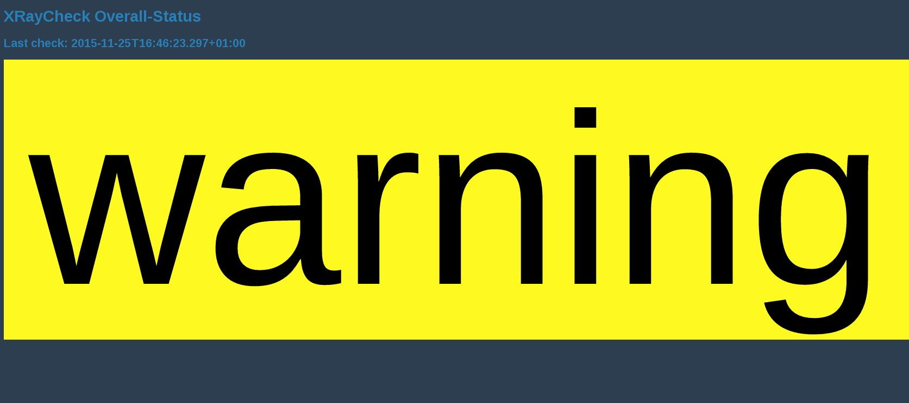
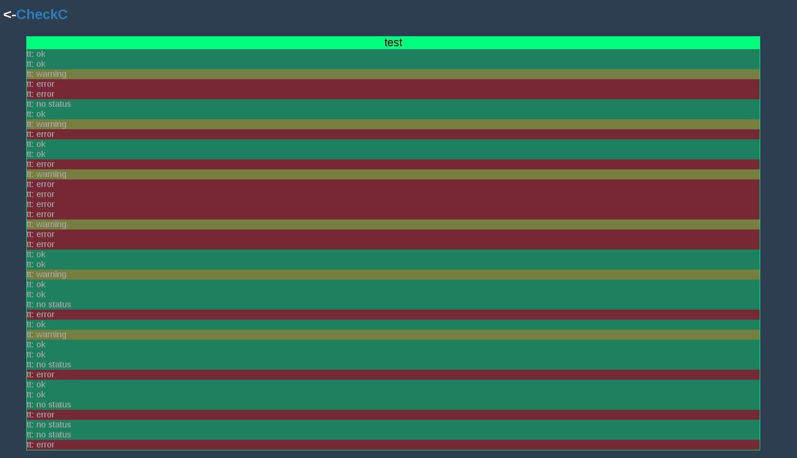

# tesla-xray
tesla-xray is a component for executing and visualizing checks.   
It can be used with the tesla-microservice.

		[](http://clojars.org/de.otto/tesla-xray)

[](https://travis-ci.org/otto-de/tesla-xray)
[](http://jarkeeper.com/otto-de/tesla-xray)

  
Checks return Check-Results which currently look like this:

			{:status <ok/error>
			:message <your message>}
			
			(->XRayCheckResult :error "That is an error")

	* Checks can pretty much check/assert anything you like, implementation is up to you
	* A unlimited number of custom-written-checks can be registered
	* Registered checks are executed in a configurable time-schedule
	* The check-results are stored and are visualized for you (3 abstraction levels)
	* An alerting function can be registered

Ideas for further features:  

	* App-Status which shows the status of registered checks

## Usage
Add a xray-checker to your system:

		(:require [com.stuartsierra.component :as component]
				  [de.otto.tesla.xray.xray-checker :as checker]
				  [de.otto.tesla.system :as tesla])
					
		(-> (tesla/base-system {})
			(assoc :check (component/using (your-check/new-check) [:xraychecker]))
			(assoc :xraychecker (component/using (checker/new-xraychecker "xraychecker") [:handler :config])))

`Your-Check` could look like this:

		(:require [com.stuartsierra.component :as component]
				  [de.otto.tesla.xray.xray-checker :as checker]
				  [de.otto.tesla.xray.check :as check])
				  
		(defn- default-strategy [results]
		  (:status (first results)))
		  
		(defn- alerting-fn [{:keys [last-result overall-status check-name env]}]
		  (let [{:keys [status message time-taken stop-time]} last-result]
		  	
			(log/info "ALERT: " check-name " has status " overall-status " on "  env " at " stop-time " after " time-taken "ms. message was: " message)))
		
		(defrecord YourCheck [xraychecker]
		  component/Lifecycle
		  (start [self]
		  	(checker/set-alerting-function xraychecker alerting-fn)
			(checker/register-check-with-strategy xraychecker self "YourAwesomeCheck" default-strategy)
			self)
		  (stop [self]
			self)
		  
		  check/XRayCheck
		  (start-check [self environment]
			(if you-dont-care?
			  (check/->XRayCheckResult :none "I do not care!")
			  (if what-ever-you-like-to-check-is-an-error?
				(check/->XRayCheckResult :error "I found an error")
				(check/->XRayCheckResult :ok "Fromage")))))

## Configuration
These are the currently supported properties:
```clojure
			:yourchecker-check-environments "env1;env2;env3" ;the envs where you want to execute your checks
			:yourchecker-check-frequency "60000" ;schedule for executing the checks in ms (execution is done in parallel)
			:yourchecker-check-endpoint "/xray-checker" ;where the ui shows up
			:yourchecker-max-check-history "100" ;nr of checks to keep (in memory)
			:yourchecker-nr-checks-displayed "5" ;nr checks to be diplayed for a check/env on /xray-checker/overview
			:yourchecker-acknowledge-hours-to-expire 1 ;time for acknowledgements in hours, default is 24 (one day)
```			

## UI
### Endpoint: /

### Endpoint: /overview

### Endpoint: /detail/CheckC/test



## Acknowledgement

You are able to acknowledge checks that have an error by clicking on the check header in the detail view.
 Acknowledgement lasts until it expires (default: one day, see config) or the check turns ok again.

Endpoints for acknowledgement:
* `/acknowledged-checks` GET: show all acknowledged checks and their expiration time
* `/acknowledged-checks` POST: set new acknowledgement, parameters are: 
    * `check-name` name of check to acknowledge
    * `environment` in which environment the check should be acknowledged
    *   `hours` acknowledgement time (in hours)
* `/acknowledged-checks/<check-name>/<environment>` DELETE: delete acknowledgement for the check and environment specified in url

## Initial Contributors

Kai Brandes

## License
Apache License